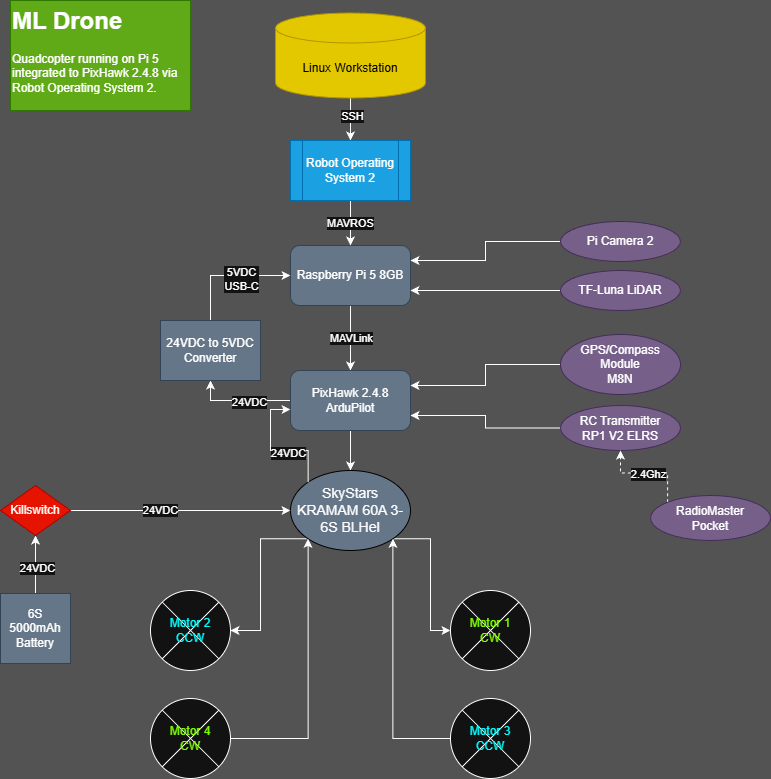

# ML_Quadcopter

**Machine Learning–Enabled Autonomous Quadcopter Platform**

## Overview

This project focuses on building an **autonomous quadcopter system** capable of perception-driven flight using machine learning and robotics frameworks.

The platform integrates:

* **Pixhawk 2.4.8** flight controller running **ArduPilot**
* **ROS2 Jazzy** robotics middleware
* **Raspberry Pi 5** companion computer
* **Camera-based human detection**
* **MAVLink communication via MAVROS**
* Planned deployment of ML models using **Google Coral TPU**

The long-term objective is to develop a drone capable of **detecting and tracking humans autonomously** while maintaining safe and stable flight behavior.

---

## System Architecture

Below is the high-level architecture of the system:



Core system flow:

```text
Camera → ML Inference → ROS2 Node → MAVROS → Pixhawk → Motors
                     ↑
                 Telemetry
```

The Raspberry Pi companion computer handles perception and decision-making, while the Pixhawk flight controller maintains flight stability.

---

## Hardware Configuration

| Component             | Model                          |
| --------------------- | ------------------------------ |
| Flight Controller     | Pixhawk 2.4.8                  |
| Firmware              | ArduPilot (ArduCopter)         |
| Companion Computer    | Raspberry Pi 5 (8GB)           |
| Camera                | Raspberry Pi Camera Module     |
| Accelerator (Planned) | Google Coral USB TPU           |
| GPS                   | u-blox M8N                     |
| ESC                   | 4-in-1 BLHeli_32               |
| Frame                 | 5" and 10" quad configurations |

---

## Software Stack

| Layer               | Technology       |
| ------------------- | ---------------- |
| Flight Control      | ArduPilot        |
| Middleware          | ROS2 Jazzy       |
| Communication       | MAVLink / MAVROS |
| Vision              | Python + OpenCV  |
| Machine Learning    | PyTorch          |
| Inference (Planned) | TensorFlow Lite  |
| Visualization       | RViz2            |
| Ground Control      | QGroundControl   |
| Containerization    | Docker           |

---

## Current Status

🚧 **Active Development**

Current progress includes:

* ROS2 Jazzy installed and operational
* MAVROS successfully communicating with Pixhawk
* IMU and telemetry data streaming via ROS2
* Docker-based ROS2 environment configured
* System architecture defined
* Hardware platform assembled and operational

---

## Development Roadmap

This project follows a staged development process progressing from hardware integration to autonomous perception and control.

---

### Phase 1 — Hardware Platform Assembly ✅ (Completed)

Core flight hardware assembled and validated.

Completed:

* [x] Frame assembly and motor installation
* [x] ESC installation and wiring
* [x] Pixhawk 2.4.8 installation
* [x] GPS module installation (u-blox M8N)
* [x] Power distribution and battery integration
* [x] RC receiver installation
* [x] Initial hardware validation and bench testing
* [x] Companion computer (Raspberry Pi 5) integration
* [x] Camera mounting and positioning
* [x] System architecture design

---

### Phase 2 — Flight Controller & Communication Integration ✅ (Completed)

Flight controller configured and communication established.

Completed:

* [x] ArduPilot firmware installation
* [x] QGroundControl configuration
* [x] MAVLink communication validation
* [x] MAVROS integration with ROS2 Jazzy
* [x] Telemetry verification
* [x] IMU data streaming to ROS2 topics
* [x] ROS2 environment containerized using Docker
* [x] ROS2 workspace created and validated

---

### Phase 3 — Perception System Integration 🚧 (In Progress)

Developing real-time vision-based perception capabilities.

In Progress:

* [ ] Camera data pipeline validation
* [ ] Frame capture integration
* [ ] Dataset collection
* [ ] Human detection model training
* [ ] Model testing in ROS2

---

### Phase 4 — Edge Inference Deployment

Deploy optimized machine learning models to embedded hardware.

Planned:

* [ ] Convert trained model to TensorFlow Lite
* [ ] Deploy inference to Coral TPU
* [ ] Optimize inference latency
* [ ] Validate real-time detection performance

---

### Phase 5 — Autonomous Behavior Development

Enable perception-driven flight logic.

Planned:

* [ ] Target tracking logic
* [ ] Position control integration
* [ ] Navigation behavior implementation
* [ ] Safety constraint validation
* [ ] Controlled flight testing

---

### Phase 6 — Advanced Autonomy & Navigation

Expand capabilities for real-world autonomy.

Future Work:

* [ ] Visual navigation
* [ ] SLAM integration
* [ ] Multi-object tracking
* [ ] Mission planning
* [ ] Sensor fusion (IMU + GPS + Vision)

---

## Current Focus

**Active Phase:** Phase 3 — Perception System Integration

Primary development efforts are focused on integrating real-time camera input and building the machine learning pipeline required for object detection and tracking.

---

## Verified System Capabilities

The following system functions have been successfully validated:

- MAVROS communication established
- ROS2 topic streaming operational
- IMU telemetry received from Pixhawk
- ROS2 container environment operational
- Ground control telemetry verified
- System architecture validated on hardware

---

## Planned Repository Structure

As development progresses, this repository will expand to include:

```text
ML_Quadcopter/
│
├── docs/
│   ├── diagrams/
│   ├── wiring/
│
├── ros2_ws/
│   ├── src/
│   │   ├── drone_bringup/
│   │   ├── perception_nodes/
│   │   ├── control_nodes/
│
├── models/
│   ├── training/
│   ├── inference/
│
├── scripts/
│   ├── setup/
│   ├── launch/
│
├── docker/
│
├── data/
│
└── README.md
```

---

## Key Features (Planned)

* Real-time human detection
* ROS2-based modular control
* Hardware-accelerated inference
* Autonomous tracking behavior
* Expandable robotics architecture

---

## Safety Considerations

⚠️ Always follow safe drone development practices:

* Remove propellers during testing
* Use bench power supply when possible
* Verify failsafe configuration
* Test logic before live flight
* Monitor system telemetry

---

## Example Use Cases

* Autonomous human following
* Robotics experimentation
* Embedded AI research
* Perception-based flight control
* UAV autonomy prototyping

---

## Author

**Sean Costello**
MS Data Analytics Engineering — Robotics & Machine Learning Focus

GitHub:
https://github.com/scsean19

---

## Status

🚧 **Active Development — System Integration Phase**

This repository documents the development of an autonomous quadcopter platform integrating robotics, machine learning, and embedded systems.
